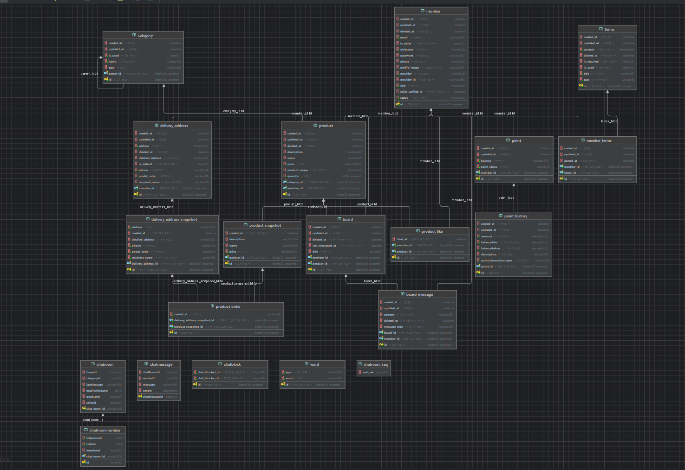

# 농산물 직거래 플랫폼
> 농부들이 직접 소비자에게 농산물을 판매할 수 있는 플랫폼을 개발하여, 중간 유통 과정을 줄이고 공정한 가격을 제공하는 것을 목적을 가진 플랫폼입니다.

# 1. Project Overview (프로젝트 개요)
- 프로젝트 이름: [fresh2you](https://github.com/fresh2you)
- 개발 기간: 24.08.26 ~ 24.10.03
# 2. Team Members (팀원 및 팀 소개)
|                  장진영                   |                     이건민                     |                     이홍교                     |
|:--------------------------------------:| :-----------------------------------------: | :-----------------------------------------: |
|  |  |  |
|                   BE                   |                     BE                      |                     BE                      |
|       https://github.com/jinyngg       |        https://github.com/Leegeonmin        |        https://github.com/LeeHongyo         |

# 3. Key Features (주요 기능)

- 회원가입 & 탈퇴
- 소셜로그인 & 로그인
- 상품페이지 조회
- 상품 추천
- 이메일 인증
- 채팅

# 4. Tasks & Responsibilities (작업 및 역할 분담)

<div style="display: flex; justify-content: space-between;">

<div style="width: 30%; border-right: 1px solid #000; padding-right: 10px; padding-left: 10px;">
<h3>장진영</h3>
<ul>
  <li>JWT & Security 작성</li>
  <li>소셜로그인 기능 구현</li>
  <li>AWS 서버 배포</li>
  <li>todo</li>
</ul>
</div>

<div style="width: 38%; border-right: 1px solid #000; padding-right: 10px; padding-left: 10px;">
<h3>이건민</h3>
<ul>
  <li>로그인</li>
  <li>게시판 작성</li>
  <li>상품 추천&조회</li>
  <li>포인트 기능</li>
  <li>이메일기반 회원가입&회원탈퇴</li>
  <li>todo</li>
</ul>
</div>

<div style="width: 30%;">
<h3>이홍교</h3>
<ul>
  <li>채팅 기능</li>
</ul>
</div>

</div>

# 5. Technology Stack & Cooperation
          

# 6. Project Architecture & ERD
### ERD

### Architecture

# 7. File Structure (프로젝트 구조)
```plaintext
📂 FreshApiProject
├─ .gitignore
├─ 📁 api
│   ├─ 📁 annotation
│   │   └─ 🗃️ LoginMember
│   ├─ 📁 client
│   │   ├─ 🗃️ KakaoApiClient
│   │   └─ 🗃️ KakaoAuthClient
│   ├─ 📁 config
│   │   ├─ 🗃️ ChattingConfig
│   │   ├─ 🗃️ FeignClientConfig
│   │   ├─ 🗃️ FilterConfig
│   │   ├─ 🗃️ RedisConfig
│   │   ├─ 🗃️ S3Config
│   │   ├─ 🗃️ SecurityConfig
│   │   ├─ 🗃️ SwaggerConfig
│   │   └─ 🗃️ WebMvcConfig
│   ├─ 📁 controller
│   │   ├─ 📁 Auth
│   │   │   ├─ 🗃️ EmailAuthController
│   │   │   └─ 🗃️ SmsAuthController
│   │   ├─ 🗃️ BoardController
│   │   ├─ 🗃️ CategoryController
│   │   ├─ 🗃️ ChatBlockController
│   │   ├─ 🗃️ ChatController
│   │   ├─ 🗃️ MemberController
│   │   ├─ 🗃️ ProductController
│   │   ├─ 🗃️ RecommendController
│   │   └─ 🗃️ TermsController
│   ├─ 📁 converter
│   │   └─ 🗃️ MultipartJackson2HttpMessageConverter
│   └─ 📁 dto
│       ├─ 📁 request
│       │   ├─ 🗃️ AddBoardMessageRequest
│       │   ├─ 🗃️ AddBoardRequest
│       │   ├─ 🗃️ AddDeliveryAddressRequest
│       │   ├─ 🗃️ ChatRoomRequest
│       │   ├─ 🗃️ LoginRequest
│       │   ├─ 🗃️ OauthLoginRequest
│       │   └─ 🗃️ UpdateProfileRequest
│       ├─ 📁 response
│       │   ├─ 🗃️ GetAllTermsResponse
│       │   ├─ 🗃️ GetTermsByIdResponse
│       │   ├─ 🗃️ SignUpRequest
│       │   └─ 🗃️ TermsDto
│       ├─ 📁 enums
│       │   └─ 🗃️ VerificationType
├─ 📁 exception
│   ├─ 🗃️ CustomAccessDeniedHandler
│   └─ 🗃️ CustomAuthenticationEntryPoint
├─ 📁 filter
│   ├─ 🗃️ JwtAuthenticationFilter
│   └─ 🗃️ JwtExceptionFilter
├─ 📁 principal
│   ├─ 🗃️ CustomUserDetails
│   └─ 🗃️ CustomUserDetailsService
├─ 📁 provider
│   ├─ 🗃️ KakaoProvider
│   ├─ 🗃️ OauthProvider
│   └─ 🗃️ TokenProvider
├─ 📁 resolver
│   └─ 🗃️ AuthorizedMemberResolver
├─ 📁 service
│   ├─ 🗃️ BoardService
│   ├─ 🗃️ CategoryService
│   ├─ 🗃️ ChatBlockService
│   ├─ 🗃️ ChatRoomService
│   ├─ 🗃️ ChatMessageService
│   ├─ 🗃️ EmailService
│   ├─ 🗃️ MemberService
│   ├─ 🗃️ ProductLikeService
│   ├─ 🗃️ ProductService
│   ├─ 🗃️ RecommendService
│   └─ 🗃️ SmsService
├─ 📁 utils
│   ├─ 🗃️ EmailUtil
│   ├─ 🗃️ RandomUtil
│   ├─ 🗃️ RedisUtil
│   ├─ 🗃️ S3Uploader
│   ├─ 🗃️ SmsUtil
│   └─ 🗃️ VerificationCodeUtil
├─ 📁 websocket
│   └─ 🗃️ WebSocketConfig
├─ 📁 common
│   ├─ 📁 constants
│   │   ├─ 🗃️ AppConstants
│   │   ├─ 🗃️ AuthConstants
│   │   ├─ 🗃️ EmailConstants
│   │   ├─ 🗃️ FileConstants
│   │   ├─ 🗃️ RedisConstants
│   │   ├─ 🗃️ SecurityConstants
│   │   └─ 🗃️ SmsConstants
│   ├─ 📁 exception
│   │   ├─ 🗃️ CustomException
│   │   ├─ 🗃️ GlobalExceptionHandler
│   │   └─ 🗃️ UnauthorizedException
│   └─ 📁 response
│       └─ 🗃️ ApiResponse
├─ 📁 domain
│   ├─ 📁 annotation
│   │   ├─ 🗃️ Reader
│   │   └─ 🗃️ Writer
│   ├─ 📁 config
│   │   ├─ 🗃️ JpaAuditingConfig
│   │   ├─ 🗃️ P6spyConfig
│   │   └─ 🗃️ QuerydslConfig
│   ├─ 📁 converter
│   │   ├─ 🗃️ CodeConverter
│   │   └─ 🗃️ TermsTypeConverter
│   ├─ 📁 dto
│   │   ├─ 🗃️ ChatMessageDto
│   │   ├─ 🗃️ UploadedFile
│   │   └─ 🗃️ UploadFile
│   ├─ 📁 entity
│   │   ├─ 📁 address
│   │   │   ├─ 🗃️ DeliveryAddress
│   │   │   └─ 🗃️ DeliveryAddressSnapshot
│   │   ├─ 📁 base
│   │   │   └─ 🗃️ BaseTimeEntity
│   │   ├─ 📁 board
│   │   │   ├─ 🗃️ Board
│   │   │   └─ 🗃️ BoardMessage
│   │   ├─ 📁 category
│   │   │   └─ 🗃️ Category
│   │   ├─ 📁 chat
│   │   │   ├─ 🗃️ ChatBlock
│   │   │   ├─ 🗃️ ChatMessage
│   │   │   ├─ 🗃️ ChatRoom
│   │   │   └─ 🗃️ ChatRoomMember
│   │   └─ 📁 member
│   │       ├─ 🗃️ Member
│   │       ├─ 🗃️ MemberTerms
│   │       └─ 🗃️ Word
│   ├─ 📁 repository
│   │   ├─ 📁 jpa
│   │   │   ├─ 🗃️ BoardJpaRepository
│   │   │   ├─ 🗃️ BoardMessageJpaRepository
│   │   │   ├─ 🗃️ CategoryJpaRepository
│   │   │   ├─ 🗃️ ChatBlockRepository
│   │   │   ├─ 🗃️ ChatMessageRepository
│   │   │   ├─ 🗃️ ChatRoomMemberRepository
│   │   │   ├─ 🗃️ ChatRoomRepository
│   │   │   ├─ 🗃️ DeliveryAddressJpaRepository
│   │   │   ├─ 🗃️ MemberJpaRepository
│   │   │   ├─ 🗃️ MemberTermsJpaRepository
│   │   │   ├─ 🗃️ OrderJpaRepository
│   │   │   ├─ 🗃️ PointJpaRepository
│   │   │   ├─ 🗃️ ProductJpaRepository
│   │   │   ├─ 🗃️ ProductLikeJpaRepository
│   │   │   ├─ 🗃️ ProductOrderJpaRepository
│   │   │   ├─ 🗃️ ProductSnapshotJpaRepository
│   │   │   └─ 🗃️ TermsJpaRepository
│   │   └─ 📁 query
│   │       ├─ 🗃️ BoardQueryRepository
│   │       ├─ 🗃️ CategoryQueryRepository
│   │       ├─ 🗃️ DeliveryAddressQueryRepository
│   │       ├─ 🗃️ MemberQueryRepository
│   │       ├─ 🗃️ OrderQueryRepository
│   │       ├─ 🗃️ PointHistoryQueryRepository
│   │       ├─ 🗃️ PointQueryRepository
│   │       ├─ 🗃️ ProductLikeQueryRepository
│   │       ├─ 🗃️ ProductQueryRepository
│   │       ├─ 🗃️ ProductSnapshotQueryRepository
│   │       └─ 🗃️ TermsQueryRepository
├─ 📁 reader
│   ├─ 🗃️ BoardMessageReader
│   ├─ 🗃️ BoardReader
│   ├─ 🗃️ CategoryReader
│   ├─ 🗃️ ChatMessageReader
│   ├─ 🗃️ ChatRoomMemberReader
│   ├─ 🗃️ ChatRoomReader
│   ├─ 🗃️ DeliveryAddressReader
│   ├─ 🗃️ MemberReader
│   ├─ 🗃️ OrderReader
│   ├─ 🗃️ PointReader
│   ├─ 🗃️ ProductLikeReader
│   ├─ 🗃️ ProductReader
│   ├─ 🗃️ TermsReader
│   └─ 🗃️ WordReader
└─ 📁 writer
│   ├─ 🗃️ BoardMessageWriter
│   ├─ 🗃️ BoardWriter
│   ├─ 🗃️ ChatMessageWriter
│   ├─ 🗃️ ChatRoomMemberWriter
│   ├─ 🗃️ ChatRoomWriter
│   ├─ 🗃️ DeliveryAddressSnapshotWriter
│   ├─ 🗃️ DeliveryAddressWriter
│   ├─ 🗃️ MemberTermsWriter
│   ├─ 🗃️ MemberWriter
│   ├─ 🗃️ PointHistoryWriter
│   ├─ 🗃️ PointWriter
│   ├─ 🗃️ ProductLikeWriter
│   ├─ 🗃️ ProductOrderWriter
│   ├─ 🗃️ ProductSnapshotWriter
│   ├─ 🗃️ ProductWriter
└─ 📁 FreshApiApplication

```

# 8. Development Workflow (개발 워크플로우)
## 브랜치 전략 (Branch Strategy)
- Develop Branch
    - 배포 가능한 상태의 코드를 유지합니다.
    - 모든 배포는 이 브랜치에서 이루어집니다.

- {type} : #이슈번호 Branch Name
    - 각 기능별 브랜치 입니다.
    - 모든 기능 개발은 이슈를 생성하고 이슈와 연동하여 개발합니다.

# 9.  커밋 컨벤션
## type 종류
```
feat : 새로운 기능 추가
fix : 버그 수정
docs : 문서 수정
style : 코드 포맷팅, 세미콜론 누락, 코드 변경이 없는 경우
refactor : 코드 리펙토링
test : 테스트 코드, 리펙토링 테스트 코드 추가
chore : 빌드 업무 수정, 패키지 매니저 수정
```

## 커밋 예시
```
예시 1.
Feat: 회원 가입 기능 구현 [#1]

예시 2.
fix: 채팅기능 버그 수정 [#2] 

```
